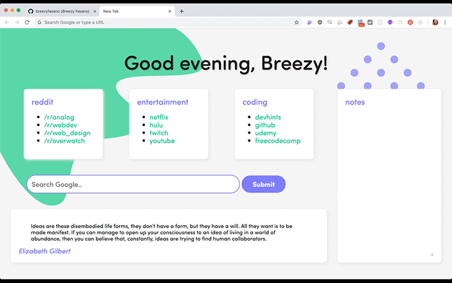

# new-tab-page-chrome-extension
My personal tab page, optimized as an extension for Google Chrome

>

### Features
- A list of common links I visit, including Reddit, Netflix, Github, etc
- A Google search
- A new generated quote every day
- A notes section; saves notes to Chrome by clicking in/out of the text area

### Tech Used
- SASS
- Flexbox for layout
- Chrome Storage API
- [the Quotes API from They Said So](https://theysaidso.com/api/)
